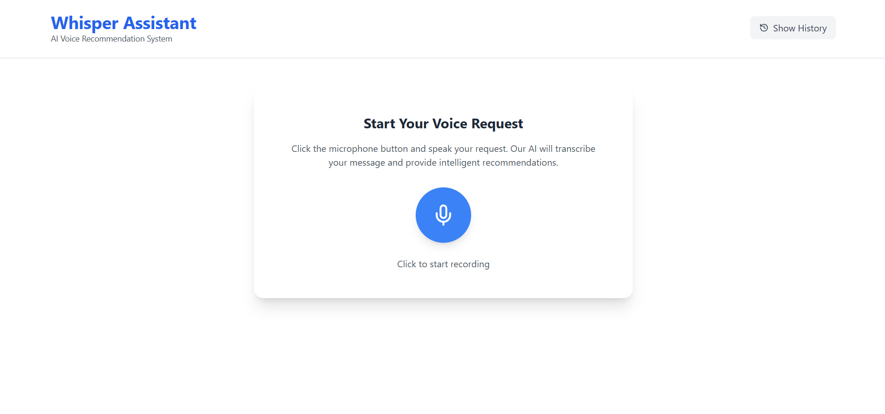
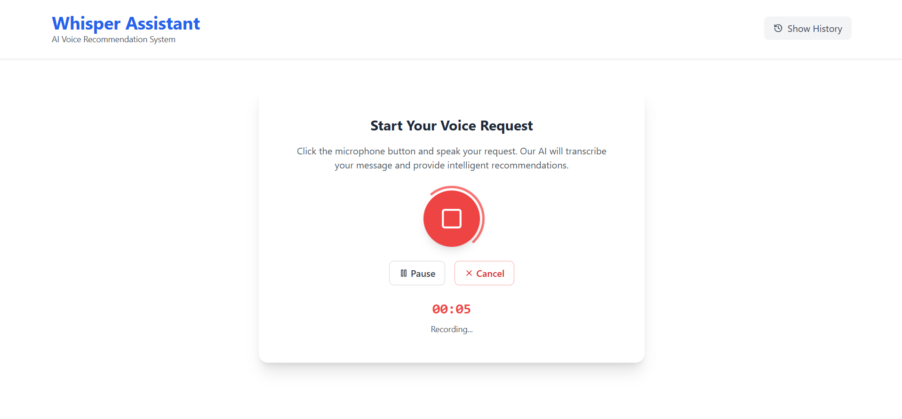
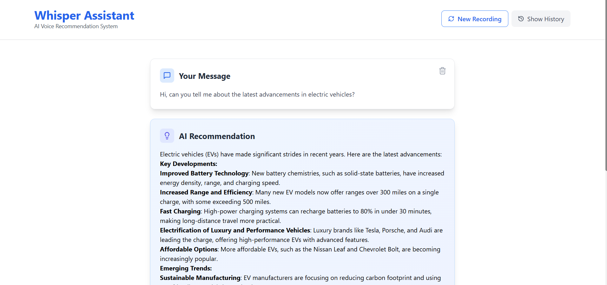
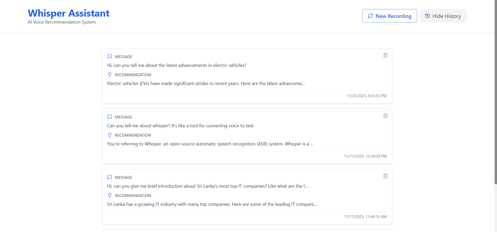

# WhisperAssist

**Modern AI Voice Assistant powered by Groq (Whisper & Llama-3.3)**

---

## 🎯 Overview

WhisperAssist is a full-stack AI voice assistant that converts speech to text using Groq Whisper, generates intelligent recommendations with Llama-3.3, and stores all interactions for future reference. The app features robust audio controls (pause, resume, cancel), history management (view, delete), and a clean, mobile-responsive UI.

---

## ✨ Features

- 🎤 **Voice Recording**: Modern browser-based audio recording with pause, resume, and cancel
- 🗣️ **Speech-to-Text**: Fast, accurate transcription via Groq Whisper
- 🤖 **AI Recommendations**: Llama-3.3-powered contextual responses
- 💾 **History Tracking**: All recommendations stored and viewable
- 🗑️ **Delete Controls**: Delete history or current result

<div align="center">
  
  
  
  
  
  
</div>

## 🛠️ Tech Stack

**Frontend:**

- React
- Tailwind CSS
- lucide-react (icons)

**Backend:**

- Node.js
- Express.js
- MongoDB
- Groq SDK (Whisper & Llama-3.3)
- Multer (file uploads)

---

## 🚀 Quick Start

### Prerequisites

- Node.js v16+
- MongoDB (local or Atlas)
- Groq API Key ([get one here](https://console.groq.com/keys))

### Installation

1. **Clone the repository**
   ```bash
   git clone https://github.com/mandinumaneth/whisperAssist.git
   cd whisperAssist
   ```
2. **Install backend dependencies**
   ```bash
   cd backend
   npm install
   ```
3. **Install frontend dependencies**
   ```bash
   cd ../frontend
   npm install
   ```
4. **Configure environment variables**
   Create `backend/.env`:
   ```env
   PORT=5000
   NODE_ENV=development
   MONGODB_URI=mongodb://localhost:27017/whisperassist
   USE_GROQ=true
   GROQ_API_KEY=your_groq_api_key_here
   FRONTEND_URL=http://localhost:5173
   ```
5. **Start the backend**
   ```bash
   cd backend
   npm run dev
   ```
6. **Start the frontend** (in a new terminal)
   ```bash
   cd frontend
   npm run dev
   ```
7. **Open your browser**
   - http://localhost:5173

---

## 🔌 API Endpoints

### Recommendations

- `POST /api/recommendations` — Create a new recommendation from audio
- `GET /api/recommendations` — Get all recommendation history
- `GET /api/recommendations/:id` — Get a specific recommendation
- `DELETE /api/recommendations/:id` — Delete a recommendation

### Instructions

- `GET /api/instructions` — Get all instructions
- `POST /api/instructions` — Create a new instruction


